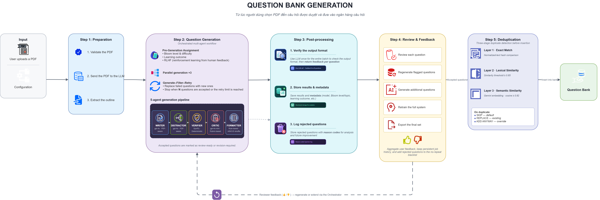
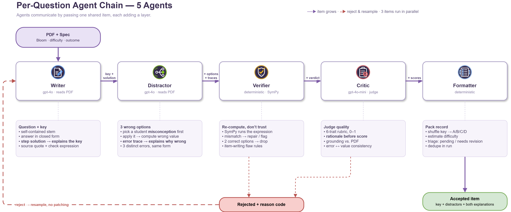

# Báo cáo kỹ thuật: Hệ thống sinh câu hỏi trắc nghiệm Toán đa tác tử có kiểm chứng và phản hồi người dùng

---

## 1. Tổng quan phương pháp

### 1.1. Mục tiêu hệ thống

Hệ thống giải quyết bài toán sinh câu hỏi trắc nghiệm tự động (Automatic Question Generation — AQG) cho môn Toán, với ba yêu cầu đặc thù vượt ra ngoài phạm vi của các hệ AQG dựa trên văn bản thông thường:

1. **Bám tài liệu nguồn.** Câu hỏi phải phát sinh từ một tài liệu cụ thể do giảng viên cung cấp, không phải từ tri thức tổng quát của mô hình ngôn ngữ.
2. **Đúng về mặt toán học.** Khác với sinh câu hỏi đọc hiểu, một câu hỏi Toán có đáp án đúng/sai xác định được bằng máy; hệ thống phải khai thác tính chất này thay vì phó thác việc thẩm định cho mô hình ngôn ngữ.
3. **Phù hợp mục tiêu đo lường.** Mỗi câu hỏi phải gắn với một mức nhận thức theo thang Bloom [8] và một chuẩn đầu ra do người dùng khai báo, để bộ câu hỏi thu được là một công cụ đo lường có cấu trúc chứ không phải một tập câu hỏi rời rạc.

Các khảo sát về sinh câu hỏi bằng mạng nơ-ron [17] và về sinh phương án nhiễu [18] đều ghi nhận rằng chất lượng và khả năng kiểm soát là hai điểm nghẽn cố hữu của AQG. Thiết kế của hệ thống được tổ chức xoay quanh chính hai điểm nghẽn này.

### 1.2. Đầu vào và đầu ra

**Đầu vào** gồm một tài liệu học liệu định dạng PDF và một cấu hình sinh do người dùng khai báo: số câu hỏi mong muốn, phân bố mức nhận thức theo thang Bloom, độ khó mục tiêu, danh sách chuẩn đầu ra, và tuỳ chọn có kèm lời giải chi tiết hay không.

**Đầu ra** là một bộ câu hỏi trắc nghiệm bốn phương án, mỗi câu mang theo: đáp án đúng, ba phương án nhiễu kèm mô tả lỗi tương ứng, lời giải từng bước, một trích dẫn nguyên văn từ tài liệu làm bằng chứng nguồn, nhãn mức Bloom, nhãn chuẩn đầu ra, ước lượng độ khó, điểm chấm theo từng tiêu chí rubric, và trạng thái duyệt. Kèm theo bộ câu hỏi là siêu dữ liệu vận hành (chi phí token, thời gian chạy, thống kê phân bố) và một danh sách các câu bị loại kèm mã lý do.

### 1.3. Các giai đoạn chính

Hệ thống vận hành qua năm giai đoạn nối tiếp:

| Giai đoạn | Nội dung | Bản chất |
|---|---|---|
| ① Chuẩn bị | Kiểm định tài liệu, đóng gói, trích dàn ý gợi ý cấu hình | Chạy ngầm, một lần |
| ② Sinh câu hỏi | Bộ điều phối vận hành chuỗi năm tác tử cho từng câu | Đa tác tử, song song |
| ③ Hậu xử lý | Kiểm chứng nhãn chuẩn đầu ra, lưu kết quả và nhật ký loại bỏ | Một lần cho cả lượt |
| ④ Duyệt | Người dùng đánh giá, sinh lại, sinh thêm, luyện tập, xuất bản | Vòng lặp con người |
| ⑤ Ngân hàng | Kiểm tra trùng lặp ba tầng rồi nhập kho | Theo từng câu |

Hình 1 trình bày toàn bộ đường đi của một tài liệu qua năm giai đoạn, cùng vị trí của chuỗi năm tác tử bên trong giai đoạn sinh và vòng phản hồi khép kín từ khâu duyệt trở lại bộ điều phối.



**Hình 1.** Kiến trúc tổng thể. Tài liệu đi qua năm giai đoạn từ trái sang phải; chuỗi năm tác tử nằm trong giai đoạn ②. Đường nét đứt phía dưới là vòng phản hồi người dùng: đánh giá ở giai đoạn ④ được đưa ngược về bộ điều phối để sinh lại hoặc sinh bổ sung mà không cần tải lại tài liệu. Ba tầng khử trùng lặp ở giai đoạn ⑤ được xếp theo chi phí tăng dần.

Điểm đáng chú ý về mặt phương pháp: giai đoạn chuẩn bị được kích hoạt **ngay khi người dùng chọn tài liệu**, tức là trước khi người dùng hoàn tất cấu hình. Đây là một quyết định về trải nghiệm nhưng có hệ quả kiến trúc — nó buộc phần đóng gói tài liệu phải tách rời hoàn toàn khỏi phần cấu hình sinh, và cho phép hệ thống dùng chính lượt đọc lướt tài liệu đó để **gợi ý ngược** cấu hình cho người dùng (chủ đề, chuẩn đầu ra, số câu hợp lý), thay vì bắt người dùng tự khai báo từ con số không.

---

## 2. Kiến trúc hệ thống

### 2.1. Vai trò của bộ điều phối

Bộ điều phối (orchestrator) chịu trách nhiệm cho một mục tiêu duy nhất: **thu về đủ N câu hỏi đạt chuẩn**. Nó không tham gia vào việc soạn nội dung câu hỏi, và cũng không tự đánh giá chất lượng. Nhiệm vụ của nó gồm ba việc.

**Thứ nhất, giao chỉ tiêu trước khi sinh.** Mỗi câu hỏi được ấn định sẵn mức Bloom, độ khó mục tiêu và một chuẩn đầu ra cụ thể *trước khi* bất kỳ lời gọi mô hình nào diễn ra. Cách tiếp cận này trái ngược với việc sinh một tập câu hỏi rồi phân loại về sau — nó biến phân bố mong muốn thành một ràng buộc đầu vào thay vì một kết quả cần hy vọng.

**Thứ hai, điều phối thực thi song song.** Các câu hỏi được sinh đồng thời theo từng đợt; phần ghép kết quả, khử trùng lặp và cập nhật trạng thái được giữ tuần tự để tránh tranh chấp dữ liệu. Bước kiểm chứng ký hiệu cũng được tuần tự hoá riêng do thư viện tính toán ký hiệu không cam kết an toàn đa luồng — đây là một bước thuần CPU và nhanh nên không gây nghẽn.

**Thứ ba, quyết định điều kiện dừng.** Bộ điều phối dừng khi đạt đủ số câu yêu cầu, khi tổng số lượt thử vượt hạn mức, hoặc khi số đợt sinh thất bại liên tiếp vượt ngưỡng — ngưỡng này được đặt tương đối theo số câu yêu cầu để một mục tiêu lớn không bị dừng sớm chỉ vì gặp một chuỗi lỗi tạm thời từ nhà cung cấp mô hình.

### 2.2. Các tác tử chức năng

Chuỗi xử lý cho **mỗi** câu hỏi gồm năm tác tử, trong đó **hai tác tử hoàn toàn tất định, không gọi mô hình ngôn ngữ**:

| # | Tác tử | Bản chất | Nhiệm vụ |
|---|---|---|---|
| 1 | Writer | Mô hình ngôn ngữ đọc tài liệu | Soạn đề, đáp án, lời giải, trích dẫn nguồn, biểu thức kiểm chứng |
| 2 | Distractor | Mô hình ngôn ngữ đọc tài liệu | Ba phương án nhiễu theo lối "chọn lỗi trước" |
| 3 | Verifier | **Tất định** (tính toán ký hiệu) | Kiểm chứng toán học, soát lỗi soạn đề |
| 4 | Critic | Mô hình ngôn ngữ đọc tài liệu | Chấm bám nguồn và sáu tiêu chí rubric |
| 5 | Formatter | **Tất định** | Đóng gói bản ghi, trộn phương án, phân luồng duyệt |

Hình 2 mô tả chi tiết chuỗi này: dữ liệu mà mỗi tác tử bổ sung vào bản ghi, nhiệm vụ và ràng buộc của từng tác tử, cùng các điểm loại bỏ dẫn tới sinh lại.



**Hình 2.** Chuỗi tác tử cho mỗi câu hỏi. Các tác tử giao tiếp một chiều bằng cách truyền một bản ghi dùng chung, mỗi tác tử bồi thêm một lớp dữ liệu (nhãn trên mũi tên liền). Verifier và Formatter là hai tác tử tất định. Đường nét đứt là các điểm loại bỏ: mọi câu bị loại đều được ghi kèm mã lý do và dẫn tới **sinh lại một câu mới, không vá câu cũ**.

Sự phân chia này phản ánh một nguyên tắc thiết kế xuyên suốt: **việc gì máy tính được chính xác thì không giao cho mô hình ngôn ngữ**. Tỉ lệ hai trên năm tác tử tất định là điểm khác biệt căn bản so với các khung đa tác tử thuần LLM cho sinh câu hỏi [20], [21], [24].

Đáng lưu ý là hệ thống **không có tác tử Refiner**. Đây là một lựa chọn có chủ ý và sẽ được phân tích ở mục 4.3.

### 2.3. Luồng dữ liệu và luồng quyết định

Tài liệu nguồn được đóng gói **một lần duy nhất** thành phần đính kèm và dùng chung cho toàn bộ các lời gọi mô hình về sau. Hệ thống không trích xuất văn bản, không nhận dạng ký tự quang học, và không chia tài liệu thành các đoạn nhỏ. Điều này khiến kiến trúc khác hẳn với hướng sinh câu hỏi dựa trên truy xuất đoạn văn: thay vì đưa cho mô hình một đoạn trích rồi hỏi, hệ thống đưa cho mô hình **toàn bộ tài liệu** ở dạng gốc và giao chỉ tiêu.

Lợi ích của lựa chọn này là mô hình giữ được bố cục, ký hiệu toán học, bảng biểu và hình vẽ — những thành phần bị phá huỷ khi trích văn bản thô, vốn là vấn đề kinh niên với học liệu Toán. Hệ thống có sẵn hai chế độ đóng gói dự phòng cho các nhà cung cấp không nhận trực tiếp tệp PDF, trong đó có chế độ kết xuất từng trang thành ảnh. Đánh đổi là chi phí token đầu vào cao và giới hạn cứng về độ dài tài liệu; hướng xử lý tài liệu dài bằng đa tác tử tương tác [24] không được áp dụng ở đây.

Về **luồng quyết định**, mỗi câu ứng viên đi qua một chuỗi cổng lọc nối tiếp, và bị loại tại cổng đầu tiên không đạt:

```
Writer → (có ứng viên?) → Distractor → (đủ 3 nhiễu hợp lệ?)
       → Verifier → (không bị bác? không đa đáp án?)
       → Critic  → (bám nguồn ≥ ngưỡng? duy nhất đáp án ≥ ngưỡng?
                     nhất quán lỗi–giá trị ≥ ngưỡng?)
       → Formatter → (định dạng hợp lệ? không trùng câu đã nhận?)
       → CHẤP NHẬN
```

Điểm quan trọng: **loại bỏ tại bất kỳ cổng nào đều dẫn tới sinh lại một câu mới, không phải sửa câu cũ**.

---

## 3. Các kỹ thuật được sử dụng

### 3.1. Sinh bám tài liệu toàn văn (whole-document grounded generation)

**Mục đích.** Buộc câu hỏi phát sinh từ tài liệu người dùng cung cấp, không từ tri thức nền của mô hình.

**Cách áp dụng.** Tài liệu gốc được đính kèm nguyên vẹn vào ngữ cảnh của cả ba tác tử dùng mô hình ngôn ngữ (Writer, Distractor, Critic). Ràng buộc bám nguồn được thực thi qua hai cơ chế bổ trợ: Writer bắt buộc phải trích một đoạn nguyên văn 15–250 ký tự từ tài liệu làm bằng chứng, và Critic — khi chấm — nhận chính tài liệu đó để đối chiếu từng dữ kiện.

**Cơ sở từ nghiên cứu trước.** *Consistent with* [22]: Savaal cũng nhắm tới sinh câu hỏi từ tài liệu dài quy mô lớn, nhưng theo hướng trích xuất khái niệm rồi sinh theo khái niệm; hệ thống này không trích khái niệm mà giao toàn văn cho mô hình đa phương thức. Không có bằng chứng trong mã nguồn cho thấy phương pháp của [22] được triển khai trực tiếp.

**Điểm điều chỉnh.** Hệ thống bổ sung một **chính sách bám nguồn nới lỏng có kiểm soát**: câu hỏi được phép là *bài tập mới* với số liệu, tên gọi, đơn vị hoặc tình huống đã thay đổi, miễn là công thức, định lý, phương pháp hoặc mô-típ bài mẫu nằm trong tài liệu. Đây là điều chỉnh bắt buộc cho học liệu Toán: nếu đòi hỏi mọi con số trong câu hỏi phải xuất hiện nguyên văn trong tài liệu, hệ thống chỉ còn có thể chép lại bài tập có sẵn — đúng thứ cần tránh.

### 3.2. Lập lịch theo hạn ngạch (quota scheduling)

**Mục đích.** Bảo đảm bộ câu hỏi thu được phủ đúng phân bố Bloom yêu cầu và phủ đều danh sách chuẩn đầu ra.

**Cách áp dụng.** Mức Bloom được rải bằng **round-robin có trọng số** theo phân bố người dùng khai báo. Chuẩn đầu ra được chọn theo nguyên tắc **least-covered-first**: mỗi câu mới luôn nhắm vào chuẩn đầu ra đang được phủ ít câu nhất, và phép đếm này tính cả các câu *đang sinh dở* trong đợt song song hiện tại.

**Vì sao cần đếm cả câu đang sinh dở.** Khi chạy song song, số câu đã chấp nhận không còn phản ánh số câu đang được nhắm tới. Nếu chọn theo chỉ số tuần tự, một câu thất bại giữa đợt sẽ khiến chuẩn đầu ra của nó bị bỏ trống vĩnh viễn. Cơ chế đếm và giải phóng hạn ngạch khi thất bại làm cho phân bố **tự cân bằng lại**: nó trùng khớp với round-robin thuần khi mọi câu đều thành công, và tự bù chuẩn đầu ra bị hụt khi có câu rớt.

**Cơ sở từ nghiên cứu trước.** *Adopted from* [8] về thang phân loại nhận thức. *Consistent with* [23]: Elkins và cộng sự khảo sát việc dùng mô hình ngôn ngữ kết hợp thang Bloom để tạo đề kiểm tra; hệ thống này chia sẻ nguyên lý gắn mỗi câu với một mức Bloom nhưng cơ chế lập lịch hạn ngạch không xuất hiện trong bài báo đó.

**Đóng góp.** Cơ chế least-covered-first có bù hụt khi thất bại, hoạt động đúng dưới điều kiện sinh song song, không tìm thấy tương đương trong các tài liệu được cung cấp.

### 3.3. Sinh hai giai đoạn: tách lõi câu hỏi khỏi phương án nhiễu

**Mục đích.** Nâng chất lượng từng thành phần bằng cách để mỗi lời gọi mô hình tập trung vào một việc.

**Cách áp dụng.** Writer chỉ sinh *lõi* câu hỏi — đề bài, đáp án đúng, lời giải, trích dẫn nguồn, biểu thức kiểm chứng — và bị cấm sinh phương án nhiễu. Việc sinh nhiễu giao hẳn cho tác tử kế tiếp, vốn đã có sẵn đáp án đúng và lời giải làm đầu vào.

**Cơ sở từ nghiên cứu trước.** *Adapted from* [4]: Chain-of-Exemplar đề xuất tách và có cấu trúc hoá quá trình sinh phương án nhiễu cho câu hỏi giáo dục đa phương thức. Hệ thống áp dụng nguyên lý tách vai nhưng không dùng cơ chế chọn mẫu ví dụ (exemplar) của bài báo.

**Đánh đổi.** Tách vai làm tăng số lời gọi mô hình cho mỗi câu (hai thay vì một). Đây là chi phí được chấp nhận có ý thức, xem mục 8.2.

### 3.4. Suy luận từng bước có kiểm soát (structured chain-of-thought)

**Mục đích.** Vừa tạo lời giải sư phạm cho người học, vừa ép mô hình thực sự giải bài thay vì đoán đáp án.

**Cách áp dụng.** Lời giải bắt buộc được trình bày thành các bước đánh số, với **số bước tối thiểu tăng theo mức Bloom** (2/3/4/5 bước tương ứng bốn mức từ Nhận biết đến Vận dụng cao). Đồng thời mô hình bị **cấm in phần suy luận nháp** ra đầu ra.

**Cơ sở từ nghiên cứu trước.** *Adapted from* [5]. Điểm khác biệt so với chain-of-thought nguyên bản: ở [5], chuỗi suy luận là một *phương tiện* để cải thiện độ chính xác và thường bị bỏ đi sau khi lấy đáp án. Ở đây, chuỗi suy luận vừa là phương tiện vừa là **sản phẩm cuối** — nó là lời giải hiển thị cho học sinh — nên nó bị ràng buộc về hình thức trình bày và độ dài tối thiểu, điều không có trong [5].

### 3.5. Sinh nhiễu error-first theo quan niệm sai lầm

**Mục đích.** Bảo đảm mỗi phương án nhiễu tương ứng với một con đường làm sai có thật, thay vì một con số ngẫu nhiên trông giống đáp án.

**Cách áp dụng.** Quy trình đảo ngược thứ tự thông thường theo ba bước: (i) chọn **trước** một lỗi điển hình của học sinh; (ii) **áp lỗi đó vào chính bài toán** để *tính ra* giá trị sai; (iii) ghi giá trị đó thành phương án. Kèm theo mỗi phương án là một **mô tả chuỗi bước làm sai**, được ràng buộc sao cho ai thực hiện đúng chuỗi đó sẽ ra đúng giá trị ấy.

Hệ thống duy trì sẵn một **danh mục quan niệm sai lầm phổ biến** theo chủ đề. Mỗi bài toán được ghép với một nhóm nhỏ các lỗi khớp nội dung nhất để đưa vào ngữ cảnh cho tác tử chọn. Việc chọn này dùng **hạt giống ngẫu nhiên cố định theo nội dung bài**, nên cùng một bài luôn nhận cùng danh sách — bảo đảm khả năng tái lập khi gỡ lỗi hoặc đo đạc.

Ràng buộc bổ sung: ba phương án phải dùng ba lỗi khác nhau, và phải cùng dạng, cùng đơn vị với đáp án đúng.

**Cơ sở từ nghiên cứu trước.** *Consistent with* [9] và [10]: DiVERT học biểu diễn lỗi dưới dạng văn bản, LookAlike nhắm tới tính nhất quán của phương án nhiễu — cả hai đều đặt quan niệm sai lầm làm trung tâm. Hệ thống chia sẻ nguyên lý này nhưng triển khai bằng **prompting có ràng buộc, không huấn luyện**; không có bằng chứng trong mã nguồn về việc tái hiện phương pháp của hai bài báo. *Consistent with* [29]: Nagai và Uto dùng chiến lược sinh nhiễu do chuyên gia định nghĩa, tương đồng về tinh thần với danh mục quan niệm sai lầm dựng sẵn ở đây. Các hướng sinh nhiễu bằng mô hình chuyên biệt [30], [31] và bằng bản thể học [28] không được áp dụng.

**Đóng góp.** Ràng buộc "mô tả chuỗi bước làm sai phải dẫn tới đúng giá trị phương án" biến tính hợp lý của phương án nhiễu — vốn là một phẩm chất chủ quan — thành một **mệnh đề kiểm chứng được**, và chính mệnh đề này được đưa cho Critic chấm ở mục 4.2.

### 3.6. Kiểm chứng bằng chương trình (program-aided verification)

**Mục đích.** Tách năng lực *giải toán* khỏi năng lực *tự chấm* của mô hình ngôn ngữ.

**Cách áp dụng.** Writer bị buộc phải viết kèm một **biểu thức kiểm chứng máy đọc được** tương đương với bài toán, theo một trong hơn hai mươi loại đã định nghĩa (giải phương trình, đạo hàm, tích phân, giới hạn, định thức, giá trị riêng, tổ hợp, xác suất, số học mô-đun, tương đương logic, tính chất đồ thị…). Biểu thức này sau đó được **chạy thật** bằng thư viện tính toán ký hiệu [11], kết hợp đối chiếu số học tại nhiều điểm. Đáp án do đó được *máy tính lại*, không phải do mô hình tự nhận là đúng.

Với các câu hỏi khái niệm không thể kiểm bằng máy, hệ thống cho phép khai báo loại "không kiểm chứng" thay vì ép một biểu thức khiên cưỡng.

**Cơ sở từ nghiên cứu trước.** *Adapted from* [6] và [7]. Ở PAL và Program-of-Thought, chương trình được sinh ra để **giải** bài toán và kết quả của chương trình *chính là* câu trả lời. Ở đây, mô hình vẫn tự giải bài bằng ngôn ngữ tự nhiên, còn chương trình đóng vai trò **kiểm chứng độc lập** cho lời giải ấy. Hai nguồn kết quả độc lập cho phép phát hiện bất đồng — điều không tồn tại trong kiến trúc gốc, nơi chỉ có một nguồn duy nhất.

**Đóng góp.** Đây là chốt chặn đặc thù cho môn Toán mà các pipeline AQG thuần mô hình ngôn ngữ [19], [21], [26], [27] không có. Nó cũng là nền tảng cho hai kỹ thuật dẫn xuất ở mục 4.1.

### 3.7. Kiểm soát độ khó hai trục

**Mục đích.** Ngăn hiện tượng mô hình luôn chọn phiên bản số liệu dễ nhất dù đã đáp ứng đúng mức Bloom.

**Cách áp dụng.** Độ khó được khống chế trên hai trục độc lập:

- **Trục số bước suy luận** — ràng buộc bằng mức Bloom: từ mức Thông hiểu trở lên cấm hỏi định nghĩa chép lại; mức Vận dụng cao bắt buộc phối hợp từ hai kỹ thuật trở lên.
- **Trục độ nặng phép tính** — ràng buộc bằng một bộ điều kiện leo thang theo độ khó mục tiêu: cấm dùng bộ số kinh điển của dạng bài; mức giữa buộc phải có dữ kiện mà người học tự biến đổi mới ra được; mức cao nhất buộc ra bài chứa tham số, bài ngược, hoặc phối hợp kỹ thuật.

**Cơ sở từ nghiên cứu trước.** Không thể xác nhận từ mã nguồn hoặc tài liệu được cung cấp rằng kỹ thuật này bắt nguồn từ một bài báo cụ thể. Nó xuất phát từ một quan sát vận hành: khi chỉ ràng buộc mức Bloom, mô hình đáp ứng đúng *hình thức* của mức nhận thức nhưng chọn số liệu dễ nhất có thể, khiến độ khó thực tế không đổi giữa các mức.

### 3.8. Học sở thích trong ngữ cảnh (in-context preference learning)

**Mục đích.** Đưa phản hồi của người dùng vào các lượt sinh sau mà không cần huấn luyện lại mô hình.

**Cách áp dụng.** Phản hồi của người dùng cho từng câu (đánh giá tích cực/tiêu cực, thẻ lý do có cấu trúc, bình luận tự do) được tổng hợp thành một **khối chỉ dẫn dạng văn bản**, rồi tiêm thẳng vào ngữ cảnh của Writer và Distractor ở các lượt sau. Phần tổng hợp thẻ lý do là tất định; chỉ phần cô đọng bình luận tự do mới cần gọi mô hình, và đây là bước best-effort — lỗi thì liệt kê thô.

**Cơ sở từ nghiên cứu trước.** *Adapted from* [3]. Đây là một điều chỉnh đáng kể: [3] huấn luyện một mô hình phần thưởng từ so sánh của con người rồi tinh chỉnh chính sách bằng học tăng cường. Hệ thống này giữ lại *tín hiệu* và *mục tiêu* (điều hướng đầu ra theo sở thích người dùng) nhưng bỏ hoàn toàn phần huấn luyện, thay bằng điều hướng qua ngữ cảnh. Đánh đổi rõ ràng: hiệu lực tức thì và chi phí bằng không, đổi lấy việc sở thích không được nội tại hoá vào trọng số mô hình và phải trả phí token lặp lại ở mọi lượt.

### 3.9. Ràng buộc phủ định (negative prompting)

**Mục đích.** Chống lặp dạng bài giữa các câu trong cùng một bộ và giữa các lượt sinh.

**Cách áp dụng.** Đề bài của mọi câu đã được chấp nhận — cùng với các câu bị người dùng chê ở lượt trước — được đưa vào ngữ cảnh kèm lệnh cấm lặp lại cùng dạng hoặc cùng số liệu. Do các câu trong cùng một đợt song song chạy đồng thời, chúng chỉ né được các câu đã chấp nhận trước đó; trùng lặp phát sinh trong nội bộ một đợt được chặn bởi cơ chế khử trùng lặp phía sau.

### 3.10. Tiêm chỉ dẫn theo mô-đun (skill injection)

**Mục đích.** Tránh một chỉ dẫn hệ thống khổng lồ dùng chung cho mọi tác tử.

**Cách áp dụng.** Mỗi tác tử được nạp một bộ chỉ dẫn chuyên biệt riêng theo nhiệm vụ của nó — viết câu hỏi, bám thang Bloom, soạn biểu thức kiểm chứng, bám nguồn, sinh nhiễu, chấm rubric, đối chiếu chương trình đào tạo. Lợi ích là mỗi lời gọi chỉ mang theo phần chỉ dẫn liên quan, giảm nhiễu ngữ cảnh và giảm token.

---

## 4. Cơ chế kiểm soát chất lượng

### 4.1. Kiểm chứng tất định

Ngoài việc chạy lại biểu thức kiểm chứng (mục 3.6), tầng tất định thực hiện thêm bốn nhóm kiểm tra.

**Loại trừ đa đáp án (multi-answer elimination).** Cùng bộ kiểm chứng được chạy trên cả ba phương án nhiễu. Nếu một phương án nhiễu nào cũng được xác nhận là đúng, **cả câu bị loại** — đây là bằng chứng máy cho việc đề có nhiều hơn một đáp án đúng. Kỹ thuật này chỉ khả thi nhờ ràng buộc phương án nhiễu phải cùng dạng với đáp án (mục 3.5).

**Tự sửa đáp án (answer-key repair).** Nếu đáp án ghi trong câu không khớp kết quả máy tính *nhưng* một phương án nhiễu lại khớp, hệ thống hoán đổi hai bên, viết lại các tham chiếu số trong lời giải cho nhất quán, và ghi chú lại thao tác. Cơ chế này cứu được lớp câu hỏi **đúng về bản chất nhưng dán nhầm nhãn** — một lỗi rất phổ biến và rất phí nếu vứt cả câu.

**Chính sách "không khớp ≠ sai".** Khi máy tính ra kết quả lệch với đáp án, câu **không bị loại ngay**. Cơ sở của chính sách này là một quan sát thực nghiệm: phần lớn ca lệch xuất phát từ việc *biểu thức kiểm chứng được viết không đúng đề*, chứ không phải mô hình giải sai — theo ghi nhận trong tài liệu hệ thống, chỉ khoảng 1/12 số ca lệch là sai thật. Câu được giữ lại nhưng **bắt buộc chuyển vào hàng chờ người duyệt tay**. Đây là một đánh đổi có ý thức giữa độ chính xác (precision) và độ bao phủ (recall), nghiêng về recall vì đã có tầng con người phía sau.

**Soát lỗi soạn trắc nghiệm (Item-Writing Flaws).** Một bộ quy tắc rút từ lĩnh vực đo lường giáo dục soát các lỗi ra đề kinh điển: phương án trùng hoặc gần trùng nhau, sự có mặt của từ tuyệt đối kiểu "luôn luôn"/"không bao giờ" trong phương án nhiễu (học sinh học được mẹo loại trừ), thang số không cân đối (phương án lệch quá xa về độ lớn so với trung vị thì dễ đoán), định dạng không đồng nhất giữa các phương án, và yêu cầu mỗi phương án nhiễu gắn với một quan niệm sai lầm khác nhau.

*Adapted from* [12]: Haladyna và cộng sự tổng hợp bộ hướng dẫn soạn câu hỏi trắc nghiệm từ nghiên cứu đo lường giáo dục. Hệ thống chuyển một **tập con** các hướng dẫn ấy — cụ thể là những hướng dẫn có thể diễn đạt thành vị từ máy kiểm được — thành các quy tắc tự động. Các hướng dẫn còn lại của [12] mang tính định tính và không được triển khai.

### 4.2. Đánh giá dựa trên rubric

**Model bất đối xứng.** Tác tử chấm chạy trên một mô hình **nhẹ và rẻ hơn** mô hình sinh. Lập luận: chấm là bài toán dễ hơn sinh, dùng mô hình lớn cho việc này là lãng phí. *Adapted from* [13]: MT-Bench thiết lập tính khả dụng của mô hình ngôn ngữ trong vai trò giám khảo; việc chọn model chấm nhẹ hơn model sinh là một điều chỉnh về chi phí, không phải một kết luận của bài báo.

**Nhận định trước, điểm sau.** Với **mỗi** tiêu chí, mô hình bắt buộc phải viết nhận định *rồi mới* cho điểm. Cơ chế này chống lại thói cho điểm bừa rồi bịa lý do biện minh; ngoài ra bản thân nhận định được lưu lại làm bằng chứng hiển thị cho người duyệt. *Adapted from* [14]: RMTS đề xuất sinh lý giải trước khi chấm điểm đa tiêu chí cho bài luận. Hệ thống áp dụng đúng nguyên lý này nhưng chuyển miền từ chấm bài luận sang chấm câu hỏi trắc nghiệm, với bộ tiêu chí hoàn toàn khác.

**Sáu tiêu chí rubric, thang 0–1:** độ rõ ràng; chiều sâu tư duy; mức độ khớp thang Bloom; độ hợp lý của phương án nhiễu; **tính duy nhất đáp án**; và **tính nhất quán lỗi–giá trị**. Điểm chất lượng tổng là trung bình của sáu tiêu chí. Ba tiêu chí có ngưỡng loại cứng riêng: bám nguồn dưới 0,4; tính duy nhất đáp án dưới 0,5; nhất quán lỗi–giá trị dưới 0,4.

**Tiêu chí nhất quán lỗi–giá trị** đáng được nói riêng. Nó kiểm tra hai mệnh đề: (i) thực hiện đúng chuỗi lỗi mà tác tử sinh nhiễu mô tả có ra đúng giá trị phương án đó không; (ii) lời giải có nhất quán với đáp án không. Nó bắt lớp lỗi "giải thích một đằng, con số một nẻo" — lớp lỗi mà kiểm chứng ký hiệu không thấy được vì kiểm chứng chỉ soi đáp án đúng. *Consistent with* [10] về tinh thần đánh giá tính nhất quán của phương án nhiễu.

**Chấm bám nguồn.** Tác tử chấm nhận chính tài liệu gốc và đối chiếu từng dữ kiện trong đề, đáp án, lời giải và trích dẫn. Chính sách chấm được viết rõ để tương thích với chính sách bám nguồn nới lỏng ở mục 3.1: điểm cao khi trích dẫn hiện diện và phương pháp được tài liệu hỗ trợ *dù giá trị số cuối cùng là mới tính ra*; điểm thấp chỉ khi trích dẫn không liên quan, khái niệm chính nằm ngoài tài liệu, hoặc lời giải mâu thuẫn với phương pháp trong tài liệu.

**An toàn khi chính giám khảo lỗi (fail-open).** Nếu tác tử chấm gặp sự cố hoặc kết quả không phân tích được, câu **không bị chặn**: hệ thống điền điểm trung tính và để tầng đóng gói cùng người duyệt quyết định. Nguyên tắc: một lỗi hạ tầng ở khâu chấm điểm không được phép giết oan cả lượt sinh. Bổ sung cho cơ chế này là một bước **vớt điểm từng phần** khi đầu ra bị cắt cụt giữa chừng — các tiêu chí đã chấm xong vẫn giữ được điểm thật thay vì toàn bộ rơi về trung tính.

### 4.3. Sinh–lọc–thử lại (generate–filter–retry)

**Mục đích.** Không tin bất kỳ một lượt sinh nào; mỗi câu phải sống sót qua toàn bộ chuỗi kiểm định.

**Cách áp dụng.** Câu bị loại ở bất kỳ cổng nào sẽ **bị thay bằng một câu sinh mới**, không phải được sửa cục bộ. Hệ thống **không có tác tử Refiner**.

**Cơ sở từ nghiên cứu trước.** *Consistent with* [1] và [2]: cả hai đều theo hướng sinh dư rồi xếp hạng/lọc thay vì tin một lượt sinh duy nhất.

**Đối lập có ý nghĩa với [19].** MCQG-SRefine đề xuất chính hướng ngược lại: tự phê bình, tự sửa và so sánh lặp. Hệ thống này chọn thử lại thay vì sửa, dựa trên hai lập luận. Thứ nhất, **về chi phí**: một vòng sửa cần ít nhất một lời gọi mô hình, cộng thêm chi phí kiểm định lại toàn chuỗi — không rẻ hơn sinh mới bao nhiêu. Thứ hai, **về tính sạch của trạng thái**: một câu đã sửa mang theo lịch sử của phiên bản hỏng, và các ràng buộc chéo (đáp án ↔ lời giải ↔ biểu thức kiểm chứng ↔ mô tả lỗi của từng phương án nhiễu) rất dễ trở nên bất nhất sau khi vá cục bộ — chính lớp bất nhất mà tiêu chí nhất quán lỗi–giá trị được dựng ra để bắt. Không thể xác nhận từ mã nguồn hoặc tài liệu được cung cấp rằng lựa chọn này đã được so sánh thực nghiệm với hướng của [19].

Đáng lưu ý là hệ thống cũng **không dùng tranh luận đa tác tử** (multi-agent debate). Các tác tử giao tiếp một chiều theo chuỗi, không thương lượng. Lựa chọn này *consistent with* phát hiện của [25] rằng tranh luận đa tác tử có các chế độ thất bại đáng kể và không phải lúc nào cũng cải thiện chất lượng suy luận.

### 4.4. Xử lý câu không đạt: nhật ký loại bỏ có mã lý do

Mọi điểm loại — không sinh được, thiếu phương án nhiễu, bị kiểm chứng bác, chấm rớt, đóng gói lỗi, trùng lặp, lỗi hệ thống — đều được ghi thành bản ghi có **mã lý do** và **nhãn giai đoạn**, giữ tối đa một số lượng bản ghi nhất định cho mỗi lượt để tránh phình dữ liệu khi mô hình lỗi hàng loạt. Các bản ghi này được hiển thị cho người dùng ở một tab riêng.

Về phương pháp, đây là kỹ thuật **reason-coded rejection logging**: câu bị loại không bị vứt đi mà trở thành dữ liệu chẩn đoán, cho phép trả lời câu hỏi "hệ thống đang hỏng ở khâu nào" thay vì chỉ biết "tỉ lệ đạt thấp". Đây cũng là điều kiện cần để đo đạc và cải tiến từng cổng lọc một cách độc lập.

### 4.5. Phân luồng cho người duyệt và điều kiện dừng

**Phân luồng (triage).** Mọi tín hiệu nghi ngờ tích luỹ dọc pipeline được quy về một trong hai trạng thái, kèm danh sách lý do:

- Tính duy nhất đáp án thấp, lệch mức Bloom, hoặc kiểm chứng gặp lỗi → **ép điểm chất lượng xuống mức trần thấp** và chuyển *cần sửa*.
- Điểm chất lượng hoặc bám nguồn sát ngưỡng → *cần sửa*.
- Kiểm chứng toán không khớp → **luôn** *cần sửa*, nhưng **không trừ điểm** — theo đúng chính sách "không khớp ≠ sai", một câu đúng mà biểu thức kiểm chứng viết lệch vẫn phải được xếp hạng công bằng so với các câu khác.
- Còn lại → *chờ duyệt*.

Sự tách bạch giữa "hạ điểm" và "buộc duyệt tay" là một chi tiết thiết kế quan trọng: nó cho phép hệ thống biểu đạt *sự không chắc chắn* mà không làm sai lệch *thứ hạng chất lượng*.

**Trộn vị trí phương án.** Đáp án đúng được xáo ngẫu nhiên vào bốn vị trí, và các tham chiếu tới nhãn phương án trong lời giải được viết lại cho khớp. *Consistent with* [15]: bài báo chứng minh mô hình ngôn ngữ không bền vững khi chọn phương án và chịu thiên lệch vị trí. Hệ thống dùng phát hiện này làm động cơ cho việc trộn ở phía *sinh*, trong khi [15] đề xuất các phương pháp khử thiên lệch ở phía *chọn*.

**Điều kiện dừng.** Bộ điều phối dừng khi (i) đủ số câu yêu cầu, (ii) tổng lượt thử vượt hạn mức đặt theo bội số của số câu yêu cầu cộng một khoản dự phòng, hoặc (iii) số đợt sinh thất bại liên tiếp vượt ngưỡng tương đối theo số câu yêu cầu. Điều kiện (iii) tồn tại để hệ thống không chạy vô hạn khi nhà cung cấp mô hình đang gặp sự cố; ngưỡng đặt tương đối thay vì tuyệt đối để tránh dừng sớm oan với các mục tiêu lớn.

---

## 5. Tích hợp phản hồi người dùng

### 5.1. Vòng lặp con người

Toàn bộ các thao tác sau diễn ra trên **cùng một phiên làm việc**, không phải tải lại tài liệu:

- **Duyệt từng câu**: chấp nhận, hoặc đánh dấu cần sửa.
- **Sinh lại câu bị chê**: chỉ các câu bị đánh giá kém bị thay, các câu còn lại giữ nguyên.
- **Sinh thêm**: bổ sung câu mới từ cùng tài liệu, giữ nguyên câu cũ.
- **Luyện tập**: làm thử bộ câu ngay trên hệ thống, có chấm và giải thích.
- **Xuất bản** bộ câu ra tệp.

### 5.2. Tín hiệu phản hồi và cơ chế truyền

Phản hồi được thu ở ba mức độ chi tiết: đánh giá nhị phân, **thẻ lý do có cấu trúc**, và bình luận tự do. Bộ thẻ lý do phía tiêu cực gồm các nhãn như quá dễ, quá khó, đề mơ hồ, nghi sai đáp án, nhiễu kém, lệch tài liệu, trùng dạng; phía tích cực gồm độ khó phù hợp, ngữ cảnh hay, giải thích rõ, nhiễu tốt. Mỗi thẻ được ánh xạ sang một **chỉ thị hành động** cụ thể — ví dụ, thẻ "quá dễ" không chỉ được ghi nhận mà được dịch thành chỉ thị yêu cầu tăng số bước biến đổi và cấm hỏi chép lại định nghĩa.

Việc dùng thẻ có cấu trúc thay vì chỉ bình luận tự do là một quyết định phương pháp: nó khiến phần lớn quá trình tổng hợp phản hồi trở nên **tất định và không tốn chi phí suy luận**, đồng thời cho ra chỉ thị chính xác hơn so với việc để mô hình tự diễn giải văn bản tự do.

Hồ sơ sở thích được **lưu bền theo phiên làm việc**, nên mọi lượt sinh sau — kể cả sinh thêm ở một thời điểm khác — vẫn tôn trọng phản hồi đã cho. Đây là điểm phân biệt với việc chỉ áp phản hồi cho đúng một lượt sinh lại.

### 5.3. Danh sách tránh lặp

Đề bài của tất cả câu cũ — bao gồm cả câu bị chê và câu được giữ — được đưa vào danh sách cấm lặp cho các lượt sinh sau. Hai cơ chế này (hồ sơ sở thích và danh sách tránh lặp) hoạt động độc lập: một cái điều hướng *phong cách*, một cái ngăn *trùng nội dung*.

**Đối chiếu với nghiên cứu.** *Consistent with* [29] về nguyên lý đưa chuyên gia vào vòng lặp sinh nhiễu, và *consistent with* [27] về việc thu thập nhận định của nhà giáo dục đối với câu hỏi do mô hình sinh. Điểm khác biệt: ở các bài báo này, phản hồi chuyên gia chủ yếu được dùng để *đánh giá* hệ thống hoặc định nghĩa chiến lược trước khi chạy; ở đây phản hồi được đưa trở lại vòng sinh **trong thời gian thực** và tác động lên các câu sinh kế tiếp trong cùng phiên.

---

## 6. Kiểm tra trùng lặp và xây dựng ngân hàng câu hỏi

Câu hỏi đạt yêu cầu được nhập vào một ngân hàng dùng chung. Trước khi nhập, mỗi câu đi qua **ba tầng khử trùng lặp xếp theo thứ tự chi phí tăng dần** — một câu đã bị bắt ở tầng rẻ thì không cần chạy tầng đắt.

**Tầng 1 — Trùng nguyên văn (exact matching).** So khớp đề bài sau chuẩn hoá. Chi phí gần bằng không, bắt được lớp trùng hiển nhiên.

**Tầng 2 — Gần trùng theo hình thái (lexical similarity).** So sánh đề bài đã chuẩn hoá bằng độ tương tự chuỗi, ngưỡng 0,85. Bắt được các câu chỉ khác nhau ở dấu câu, khoảng trắng hoặc vài từ.

**Tầng 3 — Trùng ngữ nghĩa (semantic similarity).** Nhúng phần tóm tắt câu hỏi thành vector rồi so cosine, ngưỡng 0,82. Đây là tầng duy nhất bắt được lớp trùng nguy hiểm nhất: **cùng một bài toán được diễn đạt khác đi hoặc thay số liệu**. Câu cũ trong ngân hàng chưa có vector nhúng được **bổ sung tự động** ngay trong lần so đầu tiên, nên hệ thống không cần một bước di trú dữ liệu riêng khi bật tính năng này.

*Adopted from* [16] cho lựa chọn mô hình nhúng. Việc dùng một nhà cung cấp nhúng tách rời khỏi nhà cung cấp mô hình chat là một quyết định kỹ thuật thuần tuý — không phải mọi cổng truy cập mô hình chat đều mở endpoint nhúng.

**Đường dự phòng và ý nghĩa của nó.** Khi không có vector nhúng, hệ thống rơi về so trùng bằng mô hình ngôn ngữ theo từng cặp. Đường này đúng về mặt chức năng nhưng có độ phức tạp lời gọi bậc hai theo kích thước ngân hàng. Theo ghi nhận trong tài liệu hệ thống, bước này giảm từ khoảng 42 giây xuống khoảng 4 giây khi chuyển sang dùng nhúng — minh hoạ vì sao khử trùng lặp ngữ nghĩa bằng nhúng là lựa chọn khả mở duy nhất khi ngân hàng lớn dần.

**Quyết định khi phát hiện trùng.** Hệ thống **không tự động loại**, mà trình bày cặp câu trùng kèm loại trùng và điểm số cho người dùng, với ba lựa chọn: **bỏ qua** (mặc định), **thay thế** câu cũ, hoặc **vẫn thêm**. Lập luận: hai câu tương tự về mặt ngữ nghĩa vẫn có thể đều hữu ích — ví dụ làm hai phiên bản của cùng một đề — và chỉ người dùng mới biết ý định sử dụng.

---

## 7. Đối chiếu với các nghiên cứu liên quan

| Kỹ thuật trong hệ thống | Bài báo | Mức độ | Điểm giống | Điểm khác / mở rộng |
|---|---|---|---|---|
| Thang phân loại nhận thức | [8] | **Adopted** | Dùng trực tiếp thang Bloom sửa đổi làm trục phân loại | Gắn thêm độ khó mục tiêu định lượng cho mỗi mức |
| Kiểm chứng ký hiệu | [11] | **Adopted** | Dùng trực tiếp thư viện tính toán ký hiệu | Áp dụng cho kiểm chứng đáp án, không phải giải toán |
| Nhúng ngữ nghĩa | [16] | **Adopted** | Dùng trực tiếp mô hình nhúng cho khử trùng ngữ nghĩa | Kết hợp với hai tầng lọc rẻ hơn phía trước |
| Kiểm chứng bằng chương trình | [6], [7] | **Adapted** | Sinh chương trình để xử lý phần tính toán | Chương trình *kiểm chứng* lời giải độc lập, không *thay thế* nó — tạo ra hai nguồn kết quả để đối chiếu |
| Suy luận từng bước | [5] | **Adapted** | Buộc trình bày chuỗi bước suy luận | Chuỗi suy luận là sản phẩm cuối (lời giải cho học sinh), bị ràng buộc hình thức và số bước tối thiểu theo mức Bloom |
| Tách sinh lõi khỏi sinh nhiễu | [4] | **Adapted** | Tách vai sinh phương án nhiễu thành giai đoạn riêng | Không dùng cơ chế chọn mẫu ví dụ của bài báo |
| Học sở thích người dùng | [3] | **Adapted** | Dùng tín hiệu ưa thích của con người để điều hướng đầu ra | Bỏ hoàn toàn phần huấn luyện; điều hướng qua ngữ cảnh, hiệu lực tức thì |
| Nhận định trước, điểm sau | [14] | **Adapted** | Bắt buộc sinh lý giải trước khi cho điểm, chấm đa tiêu chí | Chuyển miền từ chấm bài luận sang chấm câu hỏi trắc nghiệm; bộ tiêu chí khác hoàn toàn |
| Mô hình ngôn ngữ làm giám khảo | [13] | **Adapted** | Dùng mô hình ngôn ngữ chấm chất lượng sinh phẩm | Dùng model chấm **nhẹ hơn** model sinh (bất đối xứng); bổ sung cơ chế fail-open và vớt điểm từng phần |
| Soát lỗi soạn trắc nghiệm | [12] | **Adapted** | Áp dụng bộ hướng dẫn soạn MCQ từ đo lường giáo dục | Chỉ triển khai tập con các hướng dẫn diễn đạt được thành vị từ máy kiểm |
| Sinh nhiễu theo quan niệm sai lầm | [9], [10], [29] | **Consistent with** | Đặt lỗi điển hình của người học làm trung tâm của phương án nhiễu | Triển khai bằng prompting có ràng buộc, **không huấn luyện**; bổ sung ràng buộc mô tả lỗi phải dẫn ra đúng giá trị phương án |
| Sinh–lọc–thử lại | [1], [2] | **Consistent with** | Sinh dư rồi lọc thay vì tin một lượt sinh | Chuỗi cổng lọc gồm cả tầng tất định lẫn tầng rubric |
| Không dùng sửa lặp | [19] | **Consistent with** (đối lập) | Cùng nhận diện nhu cầu kiểm soát chất lượng sau sinh | Chọn **thử lại** thay vì **tự sửa lặp**, để tránh bất nhất chéo giữa các thành phần của một câu |
| Không dùng tranh luận đa tác tử | [25] | **Consistent with** | — | Các tác tử giao tiếp một chiều theo chuỗi, không thương lượng |
| Điều phối đa tác tử cho AQG | [20], [21], [24], [32] | **Consistent with** | Chia bài toán sinh câu hỏi cho nhiều tác tử chuyên trách | Hai trong năm tác tử **tất định**; các bài báo trên dùng khung thuần mô hình ngôn ngữ |
| Trộn vị trí phương án | [15] | **Consistent with** | Cùng dựa trên sự tồn tại của thiên lệch vị trí | [15] khử thiên lệch phía **chọn**; hệ thống trộn ở phía **sinh** |
| Sinh câu hỏi từ tài liệu dài | [22] | **Consistent with** | Cùng nhắm sinh câu hỏi từ tài liệu quy mô lớn | [22] trích khái niệm rồi sinh theo khái niệm; hệ thống giao **toàn văn** cho mô hình đa phương thức |
| Gắn câu hỏi với mức Bloom | [23] | **Consistent with** | Kết hợp mô hình ngôn ngữ với thang Bloom để tạo đề | Bổ sung cơ chế lập lịch hạn ngạch có bù hụt khi thất bại |
| Hệ thống sinh + đánh giá MCQ | [26], [27] | **Consistent with** | Cùng xây pipeline sinh kèm đánh giá tự động | Bổ sung tầng kiểm chứng tất định đặc thù môn Toán |
| Phản hồi chuyên gia trong vòng lặp | [27], [29] | **Consistent with** | Đưa nhận định của nhà giáo dục vào hệ thống | Phản hồi tác động **trong thời gian thực** lên các câu sinh kế tiếp cùng phiên, không chỉ dùng để đánh giá hậu kỳ |

**Các kỹ thuật không tìm thấy tương đương trong tài liệu được cung cấp** (đề xuất coi là đóng góp của hệ thống):

1. **Lập lịch chuẩn đầu ra least-covered-first có bù hụt**, hoạt động đúng dưới điều kiện sinh song song.
2. **Chính sách "không khớp ≠ sai"** — tách bạch giữa *hạ điểm chất lượng* và *buộc duyệt tay*, cho phép biểu đạt sự không chắc chắn mà không làm sai lệch thứ hạng.
3. **Tự sửa đáp án từ phương án nhiễu được kiểm chứng** — cứu lớp câu hỏi đúng nhưng dán nhầm nhãn.
4. **Loại trừ đa đáp án bằng kiểm chứng ký hiệu trên chính các phương án nhiễu**.
5. **Kiểm soát độ khó hai trục** — tách trục số bước suy luận khỏi trục độ nặng phép tính.
6. **Ràng buộc mô tả lỗi phải dẫn ra đúng giá trị phương án nhiễu**, biến tính hợp lý của phương án nhiễu thành mệnh đề kiểm chứng được.

**Ghi chú về nguồn.** Các tài liệu [2], [4], [14], [17], [18], [19], [20], [21], [22], [23], [24], [25], [26], [27], [28], [29], [30], [31], [32] có sẵn toàn văn trong kho tài liệu của dự án. Các tài liệu [1], [3], [5], [6], [7], [8], [9], [10], [11], [12], [13], [15], [16] được trích dẫn theo danh mục tài liệu tham khảo của hệ thống; nội dung của chúng không được kiểm chứng lại trong phạm vi báo cáo này, và các nhận định liên hệ với chúng được giữ ở mức thận trọng tương ứng.

---

## 8. Hạn chế của phương pháp

### 8.1. Phụ thuộc mô hình

Ba trong năm tác tử phụ thuộc hoàn toàn vào một mô hình ngôn ngữ đa phương thức bên ngoài. Hệ quả: chất lượng đầu ra biến động theo phiên bản mô hình, và sự cố của nhà cung cấp làm dừng toàn bộ hệ thống. Kiến trúc có trừu tượng hoá lớp truy cập mô hình và hỗ trợ nhiều nhà cung cấp, nhưng đây là khả năng *thay thế*, không phải khả năng *độc lập*.

Đặc biệt, **năng lực đọc tài liệu PDF nguyên bản là một yêu cầu cứng**. Các nhà cung cấp không hỗ trợ đầu vào tệp buộc hệ thống rơi về chế độ kết xuất trang thành ảnh, làm tăng đáng kể chi phí token và phụ thuộc vào chất lượng thị giác của mô hình.

### 8.2. Chi phí suy luận

Một câu hỏi thành công theo đường đi suôn sẻ tốn **ba lần gọi mô hình** (Writer, Distractor, Critic), cộng hai lần gọi dùng chung cho cả lượt (trích dàn ý lúc chuẩn bị, kiểm chứng nhãn chuẩn đầu ra lúc kết thúc). Hai tác tử tất định không tốn lời gọi nào.

Ba con số này là *cận dưới*. Do kiến trúc sinh–lọc–thử lại, chi phí thực tế tỉ lệ nghịch với tỉ lệ chấp nhận: một câu bị loại ở tầng chấm đã tiêu tốn trọn vẹn ba lời gọi. Ngoài ra, mỗi lời gọi đều mang theo **toàn bộ tài liệu** trong ngữ cảnh, nên chi phí token đầu vào tăng tuyến tính theo độ dài tài liệu và theo số câu — đây là cái giá trực tiếp của lựa chọn ở mục 3.1. Chạy song song cải thiện **độ trễ** (theo ghi nhận trong tài liệu hệ thống: khoảng 28 giây/câu so với khoảng 51 giây khi tuần tự) nhưng **không giảm chi phí**.

### 8.3. Sai lệch đánh giá

Tầng chấm rubric kế thừa mọi hạn chế đã biết của mô hình ngôn ngữ trong vai trò giám khảo [13]. Bốn rủi ro cụ thể trong thiết kế này:

- **Giám khảo và thí sinh cùng họ mô hình.** Model chấm và model sinh thuộc cùng một dòng, nên các thiên lệch hệ thống có thể tương quan — mô hình có xu hướng đánh giá cao đầu ra giống phong cách của chính nó.
- **Cơ chế fail-open làm loãng tín hiệu.** Khi tác tử chấm lỗi, điểm trung tính được điền vào. Điều này an toàn về vận hành nhưng khiến điểm chất lượng của một số câu **không phản ánh chất lượng thật** mà phản ánh sự cố hạ tầng.
- **Ngưỡng chưa được hiệu chuẩn thực nghiệm.** Các ngưỡng loại (bám nguồn 0,4; duy nhất đáp án 0,5; nhất quán lỗi–giá trị 0,4) cùng các ngưỡng khử trùng lặp (0,85 và 0,82) là những giá trị được chọn theo phán đoán kỹ thuật. Không thể xác nhận từ mã nguồn hoặc tài liệu được cung cấp rằng chúng đã được hiệu chuẩn dựa trên dữ liệu gán nhãn của con người.
- **Không có đánh giá thực nghiệm của hệ thống.** Các con số được nêu trong báo cáo (tỉ lệ khoảng 1/12 ca lệch kiểm chứng là sai thật; độ trễ; thời gian khử trùng lặp) là **ghi nhận vận hành**, không phải kết quả của một thí nghiệm có đối chứng. Không tìm thấy trong mã nguồn hoặc tài liệu được cung cấp một đánh giá so sánh với đường cơ sở, cũng như một nghiên cứu đánh giá bởi con người trên chính hệ thống này.

### 8.4. Chất lượng tài liệu đầu vào

Do không có bước nhận dạng ký tự quang học và không tiền xử lý, chất lượng đầu ra phụ thuộc trực tiếp vào chất lượng tài liệu: một tài liệu quét mờ, một bản chụp lệch, hay ký hiệu toán được vẽ dưới dạng hình ảnh chất lượng thấp đều làm hỏng khâu đọc mà **không có tín hiệu cảnh báo rõ ràng** — tầng kiểm định đầu vào chỉ giới hạn định dạng, dung lượng và số trang, không đánh giá độ đọc được.

Ngoài ra, tài liệu dài bị cắt theo giới hạn số trang. Hệ quả về mặt đo lường: với một giáo trình dài, câu hỏi chỉ phủ được phần đầu tài liệu, trong khi người dùng không nhất thiết nhận biết được giới hạn này.

### 8.5. Khả năng khái quát hoá

Hạn chế lớn nhất về phạm vi: **tầng kiểm chứng tất định — điểm khác biệt cốt lõi của hệ thống — chỉ áp dụng được cho những câu hỏi có đáp án tính lại được bằng máy.** Với câu hỏi khái niệm, nhận định hay chứng minh, tầng kiểm chứng tự vô hiệu hoá, và hệ thống thoái hoá về một pipeline sinh–chấm thuần mô hình ngôn ngữ không khác biệt căn bản so với [21], [26]. Do đó, mức độ hưởng lợi từ thiết kế này **tỉ lệ thuận với tỉ trọng câu hỏi tính toán** trong bộ đề — một đại lượng phụ thuộc vào tài liệu và cấu hình, và không được hệ thống báo cáo lại cho người dùng.

Ba giới hạn phạm vi khác:

- **Ngôn ngữ.** Toàn bộ chỉ dẫn, danh mục quan niệm sai lầm, bộ thẻ phản hồi và các quy tắc soát lỗi soạn đề đều được viết cho tiếng Việt. Chuyển sang ngôn ngữ khác cần dựng lại các tài nguyên này, không chỉ dịch chỉ dẫn.
- **Danh mục quan niệm sai lầm** được dựng thủ công và phủ theo chủ đề. Với chủ đề nằm ngoài danh mục, tác tử sinh nhiễu mất đi chỗ dựa và rơi về việc tự nghĩ ra lỗi — đúng thứ mà kỹ thuật error-first được dựng ra để tránh.
- **Miền tri thức.** Các loại biểu thức kiểm chứng được liệt kê tường minh và bám sát chương trình Toán phổ thông và đại cương. Mở rộng sang môn học khác đòi hỏi định nghĩa lại toàn bộ tầng kiểm chứng, không chỉ đổi chỉ dẫn.

---

## 9. Kết luận

Hệ thống là một pipeline sinh câu hỏi trắc nghiệm Toán đa tác tử, bám tài liệu nguồn, với con người trong vòng lặp. Ba đặc điểm phân biệt nó với các hệ AQG dựa trên mô hình ngôn ngữ trong các tài liệu được khảo sát.

**Thứ nhất, hệ thống khai thác tính kiểm chứng được của môn Toán như một tài sản kiến trúc.** Hai trong năm tác tử hoàn toàn tất định. Đáp án được máy tính lại thay vì được mô hình tự nhận là đúng; sự tồn tại của nhiều đáp án đúng được phát hiện bằng cách chạy chính bộ kiểm chứng ấy trên các phương án nhiễu. Đây là chốt chặn mà các khung đa tác tử thuần mô hình ngôn ngữ không có, và nó chỉ khả thi trong miền tri thức này.

**Thứ hai, hệ thống nhất quán trong việc biến các phẩm chất chủ quan thành mệnh đề kiểm chứng được.** Tính bám nguồn được ràng buộc bằng trích dẫn nguyên văn có thể đối chiếu. Tính hợp lý của phương án nhiễu được ràng buộc bằng yêu cầu mô tả lỗi phải dẫn ra đúng giá trị của phương án. Điểm chấm rubric được ràng buộc bằng nhận định viết trước điểm. Trong cả ba trường hợp, hệ thống không hỏi mô hình "cái này có tốt không" mà buộc nó tạo ra một dấu vết mà một cơ chế khác có thể kiểm tra lại.

**Thứ ba, hệ thống xử lý sự không chắc chắn bằng phân luồng thay vì bằng loại bỏ.** Chính sách "không khớp ≠ sai", cơ chế fail-open ở tầng chấm, cơ chế tự sửa đáp án, và việc trao quyền quyết định cuối cùng cho người dùng khi phát hiện trùng lặp — tất cả đều theo cùng một nguyên tắc: khi hệ thống không chắc, nó **chuyển việc cho con người kèm lý do**, thay vì đoán. Nhật ký loại bỏ có mã lý do là hệ quả tự nhiên của nguyên tắc này: ngay cả câu bị vứt đi cũng để lại thông tin chẩn đoán.

Các đánh đổi được chấp nhận có ý thức — chi phí token cao do đính kèm toàn văn tài liệu, chi phí sinh lại thay vì sửa, và độ trễ của chuỗi năm tác tử — đều đổi lấy khả năng kiểm soát và khả năng truy vết.

Hạn chế nghiêm trọng nhất không nằm ở kiến trúc mà ở **bằng chứng**: các ngưỡng quyết định chưa được hiệu chuẩn trên dữ liệu gán nhãn của con người, và hệ thống chưa có đánh giá thực nghiệm có đối chứng. Do đó, hướng phát triển ưu tiên là một nghiên cứu đánh giá bởi chuyên gia đo lường giáo dục, nhằm (i) hiệu chuẩn các ngưỡng loại bỏ và khử trùng lặp, (ii) đo tương quan giữa điểm rubric của mô hình với đánh giá của con người, và (iii) kiểm định giả thuyết trung tâm của thiết kế — rằng tầng kiểm chứng tất định thực sự nâng độ chính xác của bộ câu hỏi so với một đường cơ sở thuần mô hình ngôn ngữ.

---

## Tài liệu tham khảo

[1] M. Heilman, N. A. Smith. *Good Question! Statistical Ranking for Question Generation*. NAACL-HLT, 2010.

[2] A. Duțulescu. *Generating Multiple-Choice Questions with Large Language Models*. University Politehnica of Bucharest (advisors: S. Ruseti, M. Dascalu), 2024.

[3] L. Ouyang et al. *Training Language Models to Follow Instructions with Human Feedback*. NeurIPS, 2022.

[4] H. Luo, Y. Deng, Y. Shen, S.-K. Ng, T.-S. Chua. *Chain-of-Exemplar: Enhancing Distractor Generation for Multimodal Educational Question Generation*. ACL, 2024.

[5] J. Wei et al. *Chain-of-Thought Prompting Elicits Reasoning in Large Language Models*. NeurIPS, 2022.

[6] L. Gao et al. *PAL: Program-aided Language Models*. ICML, 2023.

[7] W. Chen, X. Ma, X. Wang, W. W. Cohen. *Program of Thoughts Prompting: Disentangling Computation from Reasoning for Numerical Reasoning Tasks*. TMLR, 2023.

[8] L. W. Anderson, D. R. Krathwohl. *A Taxonomy for Learning, Teaching, and Assessing: A Revision of Bloom's Taxonomy of Educational Objectives*. Longman, 2001.

[9] N. Fernandez, A. Scarlatos, S. Woodhead, A. Lan. *DiVERT: Distractor Generation with Variational Errors Represented as Text for Math Multiple-choice Questions*. EMNLP, 2024.

[10] N. Parikh, N. Fernandez, A. Scarlatos, S. Woodhead, A. Lan. *LookAlike: Consistent Distractor Generation in Math MCQs*. BEA Workshop (ACL), arXiv:2505.01903, 2025.

[11] A. Meurer et al. *SymPy: Symbolic Computing in Python*. PeerJ Computer Science 3:e103, 2017.

[12] T. M. Haladyna, S. M. Downing, M. C. Rodriguez. *A Review of Multiple-Choice Item-Writing Guidelines for Classroom Assessment*. Applied Measurement in Education 15(3), 2002.

[13] L. Zheng et al. *Judging LLM-as-a-Judge with MT-Bench and Chatbot Arena*. NeurIPS Datasets and Benchmarks, 2023.

[14] S. Chu, J. W. Kim, B. Wong, M. Y. Yi. *Rationale Behind Essay Scores: Enhancing S-LLM's Multi-Trait Essay Scoring with Rationale Generated by LLMs*. Findings of NAACL, 2025.

[15] C. Zheng, H. Zhou, F. Meng, J. Zhou, M. Huang. *Large Language Models Are Not Robust Multiple Choice Selectors*. ICLR, 2024.

[16] J. Lee et al. *Gemini Embedding: Generalizable Embeddings from Gemini*. arXiv:2503.07891, 2025.

[17] S. Guo, L. Liao, C. Li, T.-S. Chua. *A Survey on Neural Question Generation: Methods, Applications, and Prospects*. 2024.

[18] E. Alhazmi, Q. Z. Sheng, W. E. Zhang, M. Zaib, A. Alhazmi. *Distractor Generation in Multiple-Choice Tasks: A Survey of Methods, Datasets, and Evaluation*. EMNLP, 2024 (arXiv:2402.01512).

[19] Z. Yao, A. Parashar, H. Zhou, W. S. Jang, F. Ouyang, Z. Yang, H. Yu. *MCQG-SRefine: Multiple Choice Question Generation and Evaluation with Iterative Self-Critique, Correction, and Comparison Feedback*. arXiv:2410.13191.

[20] K. Karbasi, K. Hong, M. A. Samadi, G. Pottie. *Multi-Agent Collaborative Framework For Math Problem Generation*. EDM (Poster/Demo), 2025.

[21] J. Wang, R. Xiao, Y.-J. Tseng et al. *Generating AI Literacy MCQs: A Multi-Agent LLM Approach*. arXiv:2412.00970, 2024.

[22] K. Noorbakhsh, J. Chandler, P. Karimi, M. Alizadeh, H. Balakrishnan. *Savaal: Scalable Concept-Driven Question Generation to Enhance Human Learning*. arXiv:2502.12477.

[23] S. Elkins, E. Kochmar, J. C. K. Cheung, I. Serban. *How Teachers Can Use Large Language Models and Bloom's Taxonomy to Create Educational Quizzes*. arXiv:2401.05914.

[24] K. Wang, D. Toibazar, A. Alfulayt, A. S. Albadawi, R. A. Alkahtani, A. A. Ibrahim, H. A. Alhomoud, S. Mohamed, P. J. Moreno. *Multi-Agent Interactive Question Generation Framework for Long Document Understanding*. IEEE MLSP, 2025 (arXiv:2507.20145).

[25] A. Wynn, H. Satija, G. Hadfield. *Talk Isn't Always Cheap: Understanding Failure Modes in Multi-Agent Debate*. arXiv:2509.05396, 2025.

[26] S. S. Mucciaccia, T. M. Paixão, F. Mutz, A. F. De Souza, C. S. Badue, T. Oliveira-Santos. *Automatic Multiple-Choice Question Generation and Evaluation Systems Based on LLM: A Study Case With University Resolutions*. COLING, 2025.

[27] G. Biancini, A. Ferrato, C. Limongelli. *Multiple-Choice Question Generation Using Large Language Models: Methodology and Educator Insights*. arXiv:2506.04851, 2025.

[28] K. Stasaski, M. A. Hearst. *Multiple Choice Question Generation Utilizing An Ontology*. BEA Workshop, 2017.

[29] Y. Nagai, M. Uto. *Automatic Distractor Generation in Multiple-Choice Questions Using Large Language Models with Expert-Informed Distractor Strategies*. ICCE, 2025.

[30] Y. Gao, L. Bing, P. Li, I. King, M. R. Lyu. *Generating Distractors for Reading Comprehension Questions from Real Examinations*. arXiv:1809.02768.

[31] Z. Qiu et al. *Automatic Distractor Generation for Multiple Choice Questions in Standard Tests*. COLING, 2020.

[32] Y.-H. Jiang. *Multi-Agent System for Math Learning: Contextualized Mathematics Multiple-Choice Question Generation with Agentic Workflow*. East China Normal University.
